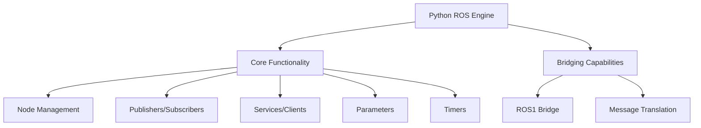

# Python ROS2 Engine

A pure Python implementation of ROS2 core functionality with bridging capabilities to interact with native ROS nodes.

[](https://badge.fury.io/py/python-ros-engine)
[](https://opensource.org/licenses/Apache-2.0)
[](https://pypi.org/project/python-ros-engine/)

## Project Structure



## Features

- Node creation and lifecycle management
- Publisher and subscriber patterns with Quality of Service (QoS) profiles
- Service and client communication
- Parameter handling with callbacks
- Topic and service discovery
- Timer functionality
- ROS1 bridging capabilities for node/topic/service discovery
- Message translation between Python ROS engine and native ROS
- Configuration with Hydra best practices

## Installation

### From PyPI
```bash
pip install python-ros-engine
```

### From Source
```bash
git clone https://github.com/yhbcode000/python-ros-engine.git
cd python-ros-engine
pip install -e .
```

## Documentation

Comprehensive documentation is available at: [https://yhbcode000.github.io/python-ros-engine/](https://yhbcode000.github.io/python-ros-engine/)

For information about building and serving the documentation locally, see the [project structure document](project_structure.md) which describes the `build_docs.py` script that can be used for this purpose.

## Examples

See the [examples](./examples) directory for complete working examples:

- Publisher/Subscriber examples
- Service/Client examples
- Bridge examples

We've also included a [complete example project](./example_project) that demonstrates how to build a robot system with multiple interconnected nodes.

## Contributing

We welcome contributions! Please see our [Contributing Guide](CONTRIBUTING.md) for details on how to contribute to this project.

## License

This project is licensed under the Apache License 2.0 - see the [LICENSE](LICENSE) file for details.